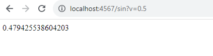

#BONO
## stefania Giraldo
###installing
´´´
git clone https://github.com/stefania5964/Bono.git
´´´
ejecuta
´´´
mvn package
´´´
inicia
´´´
mvn exec:java
´´´
puerto
´´´´
localhost:4567
´´´´
ejecute el programa 
java -cp "target/classes:target/dependency/*" org.example.SparkWebServer
luego se cre una imagen docker

docker build --tag dockersparkbono .

luego se verifica, autentica y empuja la imagen con  los siguientes comandos
´´´
docker images
docker login
docker push stefania5964/bono:latest
´´´´

ahora mostramos funcionando lo que nos pidieron 
Modifique su proyecto publicando servicios REST para calcular:

- Sin

- Cos

- Determinar si una cadena es un palíndromo

- Retorna la maginitud de un vector real de dos dimensiones, es decir recibe dos parámetros reales.

Modifique el Cliente para que se puedan llamar asíncronamente estas funciones, por ejemplo con una formulario para cada función.

